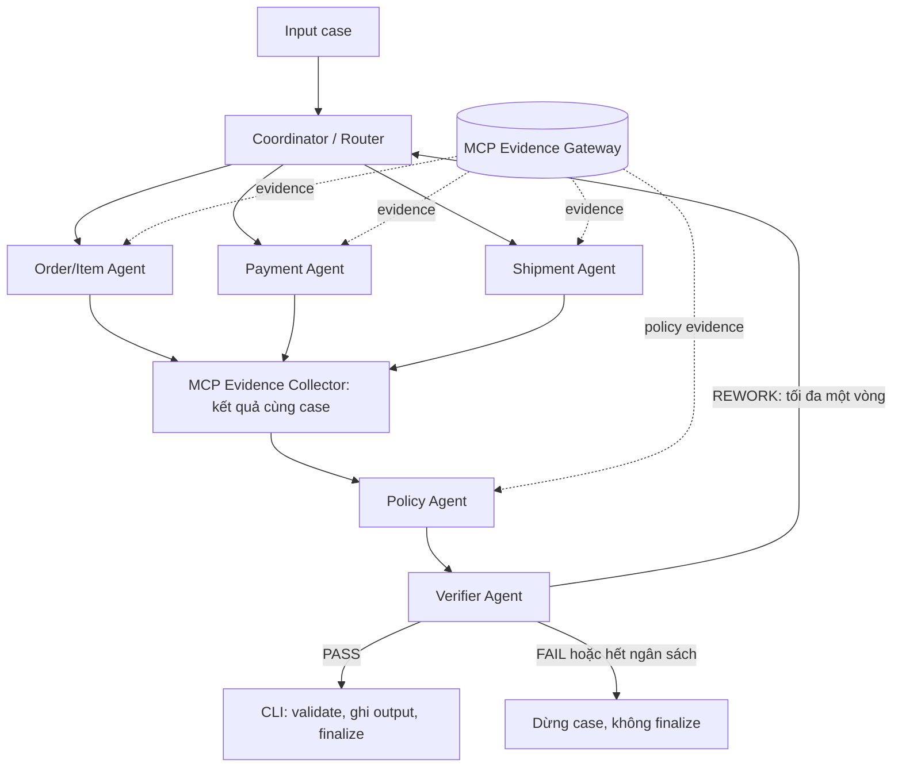

# L3A Architecture Record

## 1. Phạm vi và trạng thái

Thiết kế Pha 2 chọn Python async state-machine, với một Coordinator điều phối năm vai trò chuyên trách: Order/Item, Payment, Shipment, Policy và Verifier. A2A trong thiết kế này là trao đổi task/result có cấu trúc trong cùng tiến trình; không tuyên bố tương thích một giao thức A2A qua mạng. Mỗi agent có trách nhiệm, đầu vào, đầu ra và quyền truy cập evidence riêng.

Tài liệu này là đặc tả để triển khai tại `src/student_agent/workflow.py`, giữ nguyên entry point:

```python
async def solve_case(
    case: dict[str, Any], gateway: EvidenceGateway, trace: TraceWriter
) -> dict[str, Any]:
    ...
```

Sau Pha 3, repo đã có MCP discovery đầy đủ schema, validation request/response, phân quyền theo actor, evidence store theo case, retry/deadline và bốn specialist đọc evidence. `collect_case_evidence()` trong `workflow.py` điều phối collection và barrier trước khi đọc policy; CLI `collect-evidence` chạy độc lập và lưu báo cáo nội bộ. JSON Schema validator, trace writer và submission packager vẫn giữ public contracts.

Pha 4 đã nối `solve_case()` với Policy Engine và Verifier. Input cần `order_id` hoặc `order_ids`, `policy_version` và optional structured claims; policy rules lấy từ `get_policy`, không từ file scoring. Adapter dữ liệu cụ thể nằm trong `POLICY_ADAPTER.md`. Input và MCP `data` thật chưa có để đối chiếu, nên định dạng khác sẽ lỗi tường minh. Phần tự phân rã claim từ văn bản, task phụ thuộc theo ID phát hiện sau, vòng sửa và A2A message đầy đủ ở mục 5 vẫn là thiết kế đích; runtime hiện dùng `SpecialistTask`, `SpecialistResult` và collector riêng cho từng lượt chạy.

## 2. Public contracts được giữ nguyên

Các file đã phát hành trong `contracts/schemas/` là nguồn chuẩn. Không sửa enum, required fields, kiểu dữ liệu, giới hạn, `$id`, `schema_version` hoặc `additionalProperties` để hợp thức hóa output của agent. Nếu nội dung tài liệu mâu thuẫn schema, schema được ưu tiên. Chính sách này không thay thế việc kiểm tra diff hoặc kiểm tra schema bằng mã.

| Artifact | Schema chuẩn | Điểm validation |
| --- | --- | --- |
| Output L3A | `l3a-output-v2.schema.json` | Verifier, sau `solve_case()`, khi validate/package |
| Observable trace | `trace-event-v1.schema.json` | Mỗi lần `TraceWriter.emit()`, khi validate/package |
| Manifest | `submission-manifest-v2.schema.json` | Khi đóng gói |
| MCP evidence envelope | `mcp-evidence-response-v1.schema.json` | Mỗi response trước khi agent sử dụng |

Repo chọn `variant_id=l3a`, tương ứng `output_schema_version=day09-l3a-output-v2`; không trộn field của L3B vào output L3A. Schema L3B đi kèm cũng được giữ nguyên.

Output L3A có đúng các field bắt buộc: `schema_version`, `case_id`, `assessment`, `affected_entities`, `root_cause_analysis`, `evidence_refs`, `data_conflicts`, `financial_resolution`, `resolution_actions`. `claim_assessments` là field tùy chọn; thiết kế sử dụng khi input có claim ID rõ ràng. Không thêm `reasoning`, `debug`, `agent_results`, `task_id` hoặc metadata nội bộ vào output.

MCP envelope có các field bắt buộc `schema_version`, `evidence_ref`, `result_hash`, `domain`, `data`; `warnings` là tùy chọn. `data` được schema để mở, nên pass envelope schema chưa có nghĩa dữ liệu domain đủ hoặc hợp lệ. Các agent cần kiểm tra dữ liệu phục vụ nghiệp vụ, không tự sửa public schema để bổ sung các kiểm tra này.

Manifest do `submission.py` tạo. ZIP chỉ chứa `manifest.json`, `trace.jsonl` và `outputs/<case_id>.json`. Message A2A, evidence store, cấu hình chạy và debug log là dữ liệu nội bộ, không thêm vào ZIP.

## 3. Luồng điều phối và handoff



1. CLI tải case-set, kết nối MCP và discovery tool. Mỗi case bắt đầu bằng đúng một `case_received` do CLI phát. Coordinator tạo context mới, đọc yêu cầu khách hàng thành các claim cần kiểm chứng và xác định entity cần tra cứu; lời khách hàng không được coi là ground truth.
2. Coordinator giao task cho Order/Item, Payment và Shipment. Agent độc lập có thể chạy đồng thời nếu đã có entity ID hợp lệ để tra cứu. Nếu Payment/Shipment cần ID chỉ có trong order evidence, phải chờ Order/Item trả về rồi Coordinator mới giao task phụ thuộc; không đoán ID để chạy song song.
3. Mỗi specialist lấy evidence qua collector có kiểm soát quyền, kiểm tra domain/data, liên kết findings với evidence và trả kết quả về Coordinator. Collector là thành phần hạ tầng lưu/ghép evidence, không phải agent tự ra kết luận.
4. Coordinator chờ mọi task đã giao đạt trạng thái kết thúc. Collector tạo snapshot cùng case, gồm kết quả hợp lệ, evidence refs, dữ liệu thiếu và xung đột; chỉ sau đó handoff sang Policy. Task bị lỗi phải có trạng thái rõ ràng, không bị coi là đã thành công.
5. Policy lấy policy evidence cần thiết, áp dụng quy tắc lên facts đã được kiểm chứng và tạo candidate output. Policy có thể yêu cầu bổ sung evidence qua Coordinator, nhưng không tự gọi tool ngoài quyền của mình.
6. Verifier đọc candidate cùng snapshot và kiểm tra các invariant ở mục 8. Nếu sửa được, trả yêu cầu cụ thể về Coordinator. Toàn case chỉ có một vòng bổ sung/sửa chung cho cả Policy và Verifier; sau vòng đó, lỗi còn lại kết thúc case ở trạng thái thất bại.
7. Khi Verifier trả `PASS`, `solve_case()` trả đúng output L3A. CLI validate lại, kiểm tra `case_id`, ghi qua file tạm rồi replace và mới phát `case_finalized`. Workflow không phát trùng `case_received` hoặc `case_finalized`.

## 4. Agent ownership và tool permissions

Actor ID được dùng nhất quán trong trace và A2A message.

| Actor | Input | Trách nhiệm | Quyền MCP đọc evidence | Output / nơi nhận |
| --- | --- | --- | --- | --- |
| `coordinator` | Case, tool catalog, task/result | Phân rã claim, điều phối dependencies, deadline và vòng sửa | Discovery; không trực tiếp truy vấn evidence nghiệp vụ | Task cho specialist; snapshot cho Policy; nhận kết quả Verifier |
| `order-agent` | Entity được phép tra cứu, claim liên quan order/item | Xác minh order, item, seller liên quan và phạm vi entity | Domain `order`, `item`, `seller`; `customer`/`product` chỉ khi có nhu cầu rõ và được cấu hình cho phép | Findings và evidence refs về Coordinator |
| `payment-agent` | Order/payment scope và claim thanh toán | Đối soát payment, split payment, duplicate charge, refund | Domain `payment`, `refund` | Findings tài chính và evidence refs về Coordinator |
| `shipment-agent` | Order/item/shipment scope và claim giao hàng | Xác minh mốc giao hàng, độ trễ và facts hỗ trợ phân định trách nhiệm | Domain `shipment` | Timeline có evidence và findings về Coordinator |
| `policy-agent` | Snapshot ba specialist, claims và dữ liệu thiếu | Đánh giá claim, áp dụng policy, đề xuất issue/status, trách nhiệm, refund/actions | Domain `policy` | Candidate output cùng claim linkage nội bộ cho Verifier |
| `verifier` | Candidate, evidence store, findings và lịch sử task | Kiểm tra schema, scope, evidence linkage và consistency | Không gọi tool; thiếu evidence thì yêu cầu Coordinator | `PASS`, `REWORK` hoặc `FAIL` cùng mã kiểm tra |

Quyền trên là allowlist theo capability/domain, không phải danh sách tên tool giả định. Trước khi chạy case, cần lấy tên, mô tả và `inputSchema` thực tế từ discovery, rồi ánh xạ tool đã xác minh vào allowlist của từng actor. Không suy luận quyền chỉ bằng tiền tố tên tool; không cấp mọi tool cho mọi agent. Tool mới/chưa ánh xạ mặc định bị từ chối.

`EvidenceGateway.list_tools()` giữ giao diện trả tên; `discover_tools()` bổ sung catalog mô tả/input schema, xử lý pagination và cache theo connection. `CaseEvidenceCollector` cùng `AgentEvidenceClient` kiểm tra `(actor, tool_name, arguments, case_id)` trước khi gọi gateway. Chỉ wrapper/collector giữ raw gateway; specialist nhận giao diện giới hạn quyền. Wrapper gắn `case_id` từ context, không cho payload ghi đè, kiểm tra arguments theo input schema và kiểm tra domain response sau khi nhận. Đây là kiểm soát ở mức ứng dụng trong cùng tiến trình.

Allowlist hiện nằm ở `evidence.py`, ánh xạ 10 tên tool đã đối chiếu discovery live ngày 2026-09-25: Order/Item sở hữu `get_order`, `get_order_items`, `get_sellers`, `get_product_context`, `get_customer_history`; Payment sở hữu `get_order_payments`, `get_payment_timeline`, `get_refund_timeline`; Shipment sở hữu `get_shipment_summary`; Policy sở hữu `get_policy`. Mỗi task chỉ chọn một tool và các field cần đọc; tool customer/product/refund chỉ chạy khi có assignment tường minh. Runtime vẫn kiểm tra tool có trong discovery hiện tại trước khi gọi.

Các agent chỉ đọc evidence. Đề xuất hoàn tiền trong output không phải quyền thực hiện hoàn tiền hoặc thay đổi đơn hàng. Catalog có tool ghi dữ liệu thì không cấp quyền trong workflow này.

## 5. A2A message contract nội bộ

Message dưới đây là contract nội bộ dự kiến dùng typed model/dataclass với runtime validation; không thêm vào public output, MCP envelope hoặc các file schema đã phát hành.

| Field | Kiểu / ràng buộc | Ý nghĩa |
| --- | --- | --- |
| `message_id` | String duy nhất | Nhận diện message; chống xử lý trùng |
| `run_id` | String của lần chạy nội bộ | Tách bộ nhớ giữa các lần chạy; không thay thế run ID trong audit server |
| `case_id` | Khớp tuyệt đối context hiện tại | Correlation và cô lập case |
| `task_id` | String ổn định suốt một task | Ghép assignment, retry và result |
| `reply_to` | String hoặc null | Result tham chiếu message giao việc |
| `sender`, `target` | Một trong các actor ở mục 4 | Kiểm tra tuyến handoff hợp lệ |
| `kind` | `task`, `result`, `rework` | Loại message |
| `status` | `pending`, `completed`, `partial`, `failed` | Trạng thái task/result |
| `attempt` | Integer, từ 1 | Số lần thực thi task; retry MCP được đếm riêng theo call |
| `revision` | Integer, 0 hoặc 1 | Vòng xử lý đầu / vòng bổ sung-sửa |
| `deadline_at` | UTC datetime | Hạn chung của case; thời gian chờ dùng monotonic clock |
| `payload` | Object typed theo task | Scope/claim đầu vào hoặc findings/candidate/check results đầu ra |
| `evidence_refs` | Danh sách string duy nhất | Chỉ ref đã tồn tại trong evidence store cùng case/run |

Task payload chứa claim IDs nếu có, entity scope và capability cần dùng. Result payload chứa findings có cấu trúc, linkage finding/claim → evidence refs, missing facts, conflicts và error codes. Kết quả `partial` chỉ khẳng định phần có bằng chứng; không biến phần thiếu thành phủ định claim.

Coordinator kiểm tra result thuộc task đang chờ, đúng sender/target, `run_id`, `case_id`, `revision` và chưa quá hạn trước khi nhận. Result trùng được bỏ qua, result revision cũ hoặc task đã hủy bị từ chối. Sau khi đóng case, không nhận message hoặc evidence mới.

Graph chỉ cho phép các tuyến ở mục 3. Specialist không tự gọi specialist khác. Mọi yêu cầu bổ sung quay về Coordinator và dùng chung `revision=1`, không reset deadline hoặc số vòng khi chuyển agent. Quy tắc này giới hạn vòng lặp mà không cần một message bus hay service riêng.

## 6. Evidence lifecycle

1. Collector tạo request từ tool catalog, allowlist và scope task. Mỗi call truyền đúng `case_id`; ghi metadata nội bộ gồm actor, tool, arguments, task và lần thử, không ghi key xác thực.
2. Gateway kiểm tra MCP error, lấy structured content (hoặc một JSON text block) rồi validate `mcp-evidence-response-v1.schema.json` trước khi trả. Response lỗi schema hoặc sai domain không được nhập evidence store.
3. Evidence store giữ nguyên `evidence_ref`, `result_hash`, `domain`, `data`, `warnings` kèm request context riêng. Không chèn context vào envelope. Store thuộc một `(run_id, case_id)`, không dùng global cache hoặc nạp refs của submission cũ. Cùng ref nhưng payload khác bị coi là xung đột toàn vẹn.
4. Specialist kiểm tra facts/entity relationship từ `data` trước khi dùng. Mỗi finding giữ linkage tới ref hỗ trợ; việc đã tải response chưa đủ để gọi đó là evidence đã được sử dụng.
5. Khi thật sự dùng evidence cho finding/quyết định, actor phát `tool_result_consumed` với tên tool thực và refs tương ứng. Policy/Verifier khi dùng lại evidence cũng phải giữ được linkage về nguồn ban đầu.
6. Output chỉ trích dẫn refs hỗ trợ kết luận; refs trong `claim_assessments` phải nằm trong tập `evidence_refs` cấp output. Verifier đối chiếu toàn bộ với store và trace cùng case. Snapshot bàn giao chỉ đọc; cập nhật ở vòng sửa tạo snapshot revision mới.

Envelope công khai không chứa `case_id`, team hoặc server run ID. Vì vậy client kiểm soát scope qua request context và cô lập bộ nhớ; chỉ server audit xác minh được ownership chính thức. Tương tự, schema kiểm tra định dạng `result_hash`, không xác minh hash nội dung. Không tự tính hash để so sánh khi chưa có quy tắc canonicalization từ gateway.

Customer message chỉ định hướng việc điều tra. Nếu message mâu thuẫn dữ liệu có thẩm quyền, Policy ghi conflict và quyết định có evidence. Nếu các nguồn có thẩm quyền mâu thuẫn mà không có policy xác định ưu tiên, giữ conflict chưa giải quyết; không tự chọn nguồn thuận tiện.

## 7. Timeout, retry và observable trace

Các giới hạn dưới đây đã được áp dụng cho collection Pha 3 qua `CollectionLimits`: tối đa 3 MCP calls đồng thời, deadline collection 180 giây bao gồm discovery/backoff, mỗi attempt tối đa 30 giây hoặc thời gian còn lại nếu ngắn hơn. Tác vụ con bị hủy khi hết deadline và kết quả đến muộn bị loại. Khi triển khai workflow đầy đủ, phải dùng một deadline chung cho cả case gồm policy, verification và vòng sửa, không cấp lại 180 giây cho từng giai đoạn. CLI chạy từng case tuần tự.

Mỗi logical MCP read call thử tối đa 3 lần tổng cộng. Backoff trước lần 2 và 3 lần lượt là 1 và 2 giây; nếu server có `Retry-After` hợp lệ thì tôn trọng trong thời gian còn lại, quá deadline thì dừng. Retry giữ nguyên tool, arguments và `case_id`. Chỉ retry thao tác đọc đã xác định an toàn; audit vẫn có thể ghi nhiều calls và mỗi response có thể có ref khác nhau. Không giả định retry tạo cùng `evidence_ref` hoặc tự gửi idempotency argument chưa được tool schema cho phép.

| Failure | Retry / xử lý | Kết quả hoặc fallback | Trace event / decision code nội bộ |
| --- | --- | --- | --- |
| MCP timeout, lỗi kết nối tạm thời, 429 hoặc 5xx xác định được | Retry đọc trong giới hạn trên; không retry mọi `RuntimeError` một cách mù quáng | Hết lượt thì result `partial`/`failed`, ghi facts còn thiếu | `handoff` về Coordinator / `MCP_RETRY_REQUESTED`, rồi `task_assigned` / `MCP_RETRY`; hết lượt: `MCP_RETRY_EXHAUSTED` |
| 401/403 hoặc cấu hình kết nối sai | Không retry | Dừng run để sửa cấu hình/quyền | Task đang chạy handoff / `MCP_AUTH_FAILED`; lỗi trước case dùng log vận hành |
| Not found được tool xác nhận | Không lặp lại cùng query | Ghi missing fact; chỉ lookup khác khi discovery và scope cho phép | `handoff` / `EVIDENCE_NOT_FOUND` |
| Unknown tool, arguments sai schema, quyền không hợp lệ | Không retry | Chặn call; sửa catalog/routing | `handoff` / `TOOL_CONTRACT_REJECTED` |
| Response không đúng schema/domain, ref toàn vẹn lỗi | Không tự sửa envelope hoặc sử dụng dữ liệu | Loại response, báo thiếu evidence hoặc thất bại | `handoff` / `EVIDENCE_REJECTED` |
| Source conflict | Không retry cùng query để tìm câu trả lời khác | Policy áp dụng quy tắc nguồn nếu có; không đủ thì giữ unresolved | `policy_decided` / `SOURCE_CONFLICT_RESOLVED` hoặc `SOURCE_CONFLICT_UNRESOLVED` |
| Specialist result sai contract/scope | Từ chối; cho sửa nếu vòng `revision=1` còn khả dụng | Vẫn sai thì fail case | `handoff` / `SPECIALIST_RESULT_REJECTED` |
| Verifier không đạt | Tối đa một vòng sửa chung của case | Không đạt sau sửa thì không xuất output | `verification_completed` / `VERIFY_REWORK` hoặc `VERIFY_FAILED` |
| Hết deadline case | Hủy pending tasks; không retry thêm | Fail case, không `case_finalized` | `handoff` / `CASE_TIMEOUT`; chỉ phát verification event nếu Verifier đã chạy |

Gateway hiện hỗ trợ `is_error`/`structured_content` của SDK MCP 2 và tên camelCase tương ứng. `GatewayError` giữ mã lỗi an toàn và cờ retry; lỗi HTTP có status thì phân loại trực tiếp, lỗi JSON-RPC hoặc `is_error` không có metadata đủ rõ thì không retry. Không đoán mã lỗi từ chuỗi thông báo tùy ý, không đưa raw error của server vào trace. Timeout HTTP là 300 giây, connect/write/pool 30 giây; collector bọc deadline/cancellation để áp dụng timeout attempt 30 giây.

Thiếu dữ liệu có thể dẫn tới `assessment.primary_issue=insufficient_evidence` và `case_status=needs_investigation` chỉ khi candidate được tạo từ facts thực tế còn lại và vượt qua verifier. Không dựng refund, responsibility hay evidence giả để tạo fallback. Nếu không đủ bằng chứng cho một output trung thực, case thất bại và không được finalize; schema pass không bảo đảm vượt hard gate `missing_required_evidence` của scorer.

Trace chỉ dùng 7 event type có trong schema:

| Event | Actor → target | Thời điểm |
| --- | --- | --- |
| `case_received` | `coordinator` | CLI bắt đầu case |
| `task_assigned` | `coordinator` → agent nhận | Khi giao task, task phụ thuộc hoặc retry được chấp thuận |
| `tool_result_consumed` | Actor dùng evidence | Khi facts thực sự được dùng, kèm tool và refs |
| `handoff` | Agent gửi → agent nhận | Bàn giao task, findings, snapshot, candidate hoặc yêu cầu sửa |
| `policy_decided` | `policy-agent` | Sau khi lập hoặc điều chỉnh quyết định |
| `verification_completed` | `verifier` → `coordinator` | Sau mỗi lần kiểm tra, kèm `VERIFY_PASS`, `VERIFY_REWORK` hoặc `VERIFY_FAILED` |
| `case_finalized` | `coordinator` | CLI đã validate và ghi output thành công |

Đối với case thành công, phải có đủ `case_received`, `task_assigned`, `handoff`, `verification_completed`, `case_finalized` theo scoring policy; thứ tự nhận case trước mọi xử lý và finalize sau verification pass. Không phát event giả để bù coverage khi agent chưa làm việc.

Retry/error dùng `decision_code` và `attributes` trên event phản ánh handoff/giao việc thực tế, không thêm `error`, `retry` hoặc `tool_called` vào enum. `attributes` tối đa 20 khóa, value chỉ là string/number/integer/boolean/null; có thể chứa `task_id`, `revision`, `attempt`, `elapsed_ms`, `status`. Không nhét object, array, raw payload, API key, prompt hoặc chain-of-thought vào trace.

Mỗi event chứa tối đa 20 evidence refs, trong khi output cho phép tối đa 30; nếu một consumption cần ghi hơn 20 refs, chia thành nhiều event cùng task. Không đổi schema hoặc cắt bỏ evidence cần thiết chỉ để vừa một event.

## 8. Verification invariants trước finalize

Verifier độc lập với Policy ở vai trò và kết quả kiểm tra; không tự sửa candidate âm thầm. Nó kiểm tra:

1. **Schema:** Validate đầy đủ L3A output, kể cả nested objects, enum, field bắt buộc, giới hạn array và cấm field thừa. Không serialize nguyên state nội bộ thành output.
2. **Case/entity scope:** `case_id` khớp input; order/item/seller/payment/shipment trong output được xác minh thuộc case qua evidence. ID khách hàng nêu ra chưa tự động là affected entity đã được xác nhận.
3. **Evidence:** Mọi ref tồn tại trong store hiện tại, gắn request đúng case/run nội bộ và đã có consumption trace. Không dùng refs từ lần chạy trước. Không tuyên bố local validation thay thế MCP audit.
4. **Claim linkage:** Mỗi claim assessment tham chiếu claim ID thực của input và refs hỗ trợ verdict; không tạo claim ID giả. Ref của từng claim thuộc tập ref output; không gom evidence không liên quan chỉ để tăng coverage.
5. **Money:** Dùng decimal hoặc số nguyên cent để tính; tổng `recommended_refund_brl` bằng tổng `refund_lines.amount_brl` sau quy tắc làm tròn đã chọn, không có dòng trùng hoặc cộng hai lần khoản đã hoàn. Số tiền không âm, currency `BRL`, refund không vượt khoản hợp lệ theo evidence/policy. Chuyển sang JSON number hữu hạn ở ranh giới output.
6. **Consistency:** Status, issue và actions không mâu thuẫn; ví dụ `no_action` không đi kèm refund dương. Trách nhiệm seller cần entity/evidence hỗ trợ. Ranked causes có rank duy nhất, liên tục từ 1; actions duy nhất và có nghĩa theo policy.
7. **Conflicts/confidence:** `selected_source` thuộc `sources` nếu không null; conflict chưa giải quyết được giữ rõ. Confidence trong [0, 1], phản ánh độ hỗ trợ cho issue/verdict được chọn; không dùng mặc định 1.0. Thiếu evidence cho một cáo buộc không đồng nghĩa đủ chứng cứ phủ định cáo buộc đó.
8. **Lifecycle:** Task đã giao có kết quả hoặc trạng thái thất bại rõ ràng, không còn pending tasks; đủ sự phối hợp thật giữa actor và không nhận result quá hạn. `VERIFY_PASS` chỉ phát sau toàn bộ kiểm tra đạt.

Các consistency invariant là quy tắc ứng dụng bổ sung; public JSON Schema vẫn là nguồn chuẩn cho hình dạng artifact. `VerifierAgent` kiểm tra case/evidence scope, quyết định tiền/trách nhiệm, confidence và lifecycle trên collection hiện tại. `day09 validate` kiểm tra schema, inventory, tiền và lifecycle nhưng không có quyền đọc lại MCP audit của server; provenance cuối cùng vẫn thuộc server.

## 9. Reproducibility và kiểm chứng triển khai

Baseline không phụ thuộc framework multi-agent hoặc model LLM. Nếu bổ sung LLM, phải ghi provider/model ID, phiên bản prompt, sampling parameters và cấu hình tool trong metadata chạy nội bộ; chỉ dùng kết quả sau validation và grounding bằng evidence. Không lưu thông tin xác thực vào tài liệu hoặc artifact.

Python yêu cầu >=3.11. `pyproject.toml` hiện dùng dependency ranges, chưa có lockfile. Để tái lập bản nộp, cần ghi exact Python/dependency versions, Git commit, case-set version, contract versions và tạo lockfile được review khi triển khai. Nội dung public contracts phải có diff rỗng so với bản release đã chọn trước khi nộp.

Chốt cấu hình dự kiến: 1 case tại một thời điểm, tối đa 3 MCP calls đồng thời, 30 giây/attempt, 3 attempts/read call, deadline case 180 giây, tối đa 1 vòng sửa. Không dùng random trong quyết định nghiệp vụ; event IDs và timestamps vẫn thay đổi giữa các lần chạy. Nếu thêm thuật toán ngẫu nhiên cần ghi seed. Policy nên lấy thời điểm nghiệp vụ từ case/evidence khi có, không mặc định dùng thời gian máy để suy luận trạng thái lịch sử.

Các lệnh kiểm tra từ root repo sau khi cài môi trường và tải inputs hợp lệ; chỉ chạy end-to-end sau khi đối chiếu `POLICY_ADAPTER.md` với input và `get_policy` thực tế:

```bash
python -m pytest -q
python -m ruff check src tests
day09 validate-inputs
day09 mcp-tools
day09 mcp-tools --json
day09 collect-evidence --help
day09 run
day09 validate
day09 package --output dist/submission.zip
```

`day09 run` hiện xóa output JSON và trace cũ trước khi chạy; cần lưu riêng artifact của lần chạy cần giữ. Chưa có resume/checkpoint trong starter. Chỉ chạy end-to-end sau khi hoàn thiện `solve_case()` và có case-set/MCP hợp lệ.

Tiêu chí nghiệm thu khi triển khai workflow:

- Fake gateway kiểm tra đường thành công với ba specialist, Policy và Verifier; task phụ thuộc không gọi trước khi có entity ID, còn task độc lập tuân thủ concurrency limit.
- Kiểm tra từ chối field thừa ở output/trace/manifest/envelope; giữ nguyên public schema và tách internal message metadata khỏi artifact.
- Kiểm tra permission, arguments, sai domain, case scope, result trùng/quá hạn, evidence ref không tồn tại và evidence chéo case/run.
- Kiểm tra retry đúng lỗi tạm thời và đúng số lượt; auth/schema/not-found không bị retry mù quáng; deadline hủy task và vòng sửa không lặp vô hạn.
- Kiểm tra conflict, partial evidence, refund totals, claim linkage và sự nhất quán status/actions; output không được finalize khi verifier fail.
- Kiểm tra đủ trace lifecycle, thứ tự receive/verify/finalize, evidence consumption thực tế và giới hạn 20 refs/event.
- Chạy case-set thật, validate/package và đối chiếu feedback công khai; test starter hiện có không chứng minh workflow A2A hay nghiệp vụ đã đúng.

Pha 3 bổ sung `tests/test_evidence_collection.py` cho discovery, SDK response forms, quyền/scope, ref integrity, consumption, retry, concurrency, deadline và CLI collection tách khỏi artifact nộp bài. Pha 4 bổ sung policy/verifier và adapter riêng cho bundle chính thức, mô tả trong `POLICY_ADAPTER.md`. Pha 5 đã chạy 100 case với MCP thật: `day09 validate-inputs` và `day09 validate` đều đạt, với 100 outputs và 3460 trace events. Đây là xác thực cục bộ về contract/lifecycle; điểm nghiệp vụ và provenance cuối cùng vẫn do server chấm.
